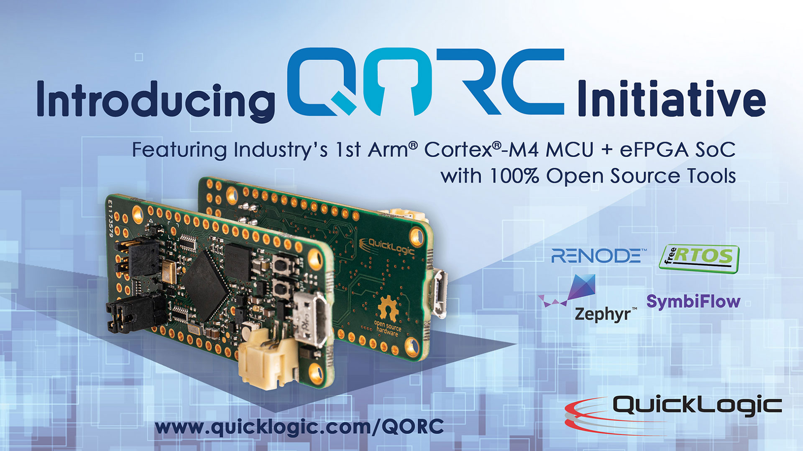
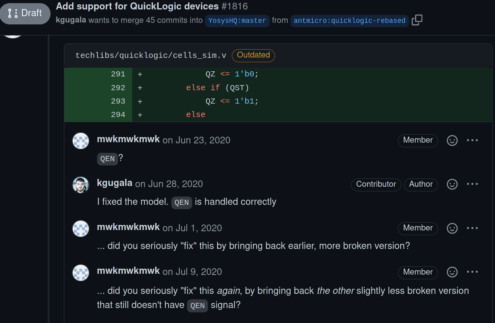
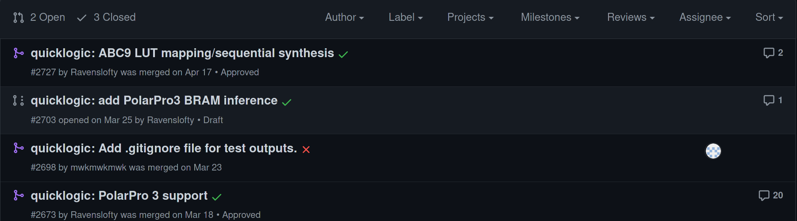
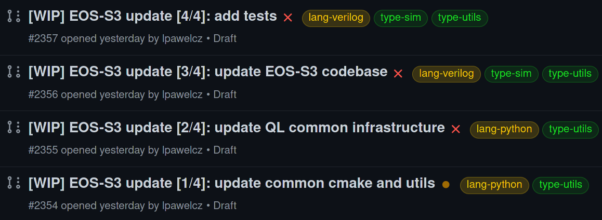

# Devlog 0 - Tratando de usar la EOS-S3

Una aventura en el mundo del workflow OSS con FPGAs y el encuentro con algunos de los retos.

<!--more-->

## El inicio de la aventura

Un día lavando platos y viendo videos salió un [video de Sparkfun anunciando una nueva devboard](https://www.youtube.com/watch?v=sFxGwaUxhlE). La misma tenía una particularidad: Hacía uso de un MCU con una eFPGA. La tarjeta en cuestión era la QuickLogic Thing Plus, y el MCU el EOS-S3. La tarjeta se veía WAPA, pero no me sentía en suficiente confianza como para verme tentado a buscarla.

Agréguele unos cuantos meses jugando con el maravilloso mundo de [Rust en embebidos](https://github.com/rust-embedded/awesome-embedded-rust) y un curso genial de Diseño Lógico con [Pablo Mendoza](https://www.researchgate.net/profile/Pablo-Mendoza-Ponce-2) en el cual hicimos uso de herramientas como `iverilog` y `Yosys`, y ya el prospecto de utilizar una tarjeta híbrida parece más atractivo.

Investigando más sobre el ecosistema todo se veía aún mejor:

- Soporte en Zephyr.
- Soporte de FreeRTOS.
- Soporte para aplicaciones de "TinyML".
- Workflow completamente OSS para el lado de la FPGA.

Para no hacer el cuento más largo, se presentó una posibilidad de hacer una compra en grupo en Digikey, y 3 de los compradores fuimos atraídos por los cantos de sirena de la devboard de Sparkfun con la EOS-S3.

## Ok pero...Cómo se programa?

Jajajajjajajajjaja...

eh...

Ahí está el detalle...

Existen 3 maneras distintas de trabajar con el dispositivo:

- La versión obsoleta que ya no existe, o mejor dicho, a la que apuntan los links de documentación de la tarjeta.
- La versión funcional, pero técnicamente obsoleta porque hace uso de versiones desactualizadas de las herramientas que componen el workflow.
- La versión "correcta", pero hasta el momento incompleta y por pura casualidad de la vida en este momento siendo completada, pero claramente no documentada de ninguna forma.


El workflow estable no es malo, pero hay que considerar que hay breaking changes respecto al qu está en desarrollo, si quieren probarlo pueden ir a [este sitio](https://SymbiFlow-examples.readthedocs.io/en/latest/getting-SymbiFlow.html) en dónde se explica como hacer la instalación de el toolchain para correr un ejemplo.

Lo que sí deben notar es que si quieren correr los ejemplos en el `qorc-sdk` tienen que tomar [esto](https://forum.quicklogic.com/viewtopic.php?f=9&t=234) y [esto otro](https://github.com/SymbiFlow/SymbiFlow-arch-defs/issues/2348) en cuenta. Si están algo cortos de tiempo la verdad es que es mejor esperar un poco a que se estabilice el nuevo workflow 


## Pero...uh...por qué

 

Un poco de investigación y saltos de repo en repo de github hace posible reconstruir medio medio la historia completa:

### Parte 1: Poseidón maldice a Odiseo

Digamos que en esta fase es cuando la gente de `SymbiFlow` comienza a hacer un push más fuerte para ser reconocidos. Varios videos de esto están disponibles en internet. El problema es que todo dependía de workflows creados a partir de hacerle ingeniería inversa a tarjetas de Lattice y Xilinx. 

Aquí es cuando surge QuickLogic, proponiendo algo que podía cambiar el paradigma de desarrollo en FPGAs, o al menos esa es la intención. No solo tener el toolchain OSS es suficiente, se requieren de plataformas Open Source en las que no sea un dolor trabajar. Además, si ya se tiene una plataforma en la que se puede trabajar "bien", claramente el atractivo para mercados como el de makers sería mayor - y este mercado, por más que a algunos profesionales en electo lo traten con desdén - sigue siendo el mercado que atrae a los contribuidores OSS que le dan soporte a una plataforma completa en micro-segundos. 

Pero...uh..oh...varios retos adelante.

### Parte 2: EOS-S3 Speedrun 50%

QuickLogic hace un esfuerzo enorme por traer la FPGA Open Source prometida, la mesías, las PolarPro3, en su primera encarnación como una eFPGA en un SoC que incluye a un Cortex M4F, el glorioso EOS-S3, pero

he...

hehe...

No tienen exactamente a los más experimentados en la industria o en la contribución de los proyectos que componen el workflow. 

 
<b>Figura 1.</b> Poster anunciando la devboard QuickFeather.

Anuncian la QuickFeather - una devboard orientada a makers basada en el MCU EOS-S3 - en crowdsupply, de manera que aquellas personas interesadas en la propuesta de QuikcLogic pudiesen colaborar con el funding de la iniciativa. La campaña alcanza su objetivo y QuickLogic consigue el dinero que necesita para "terminar" lo que falta para desarrollar en la plataforma.

QuickLogic hace forks de los repos de `Yosys`, `SymbiFlow`, VPR, etc, algo normal cuando se quiere contribuir un proyecto pero...sacan la EOS-S3 al mercado sin haber confirmado que los proyectos oficiales aceptarían los cambios. 

 
<b>Figura 2.</b> La mantainer de `Yosys` regañando a un desarrollador de QuickLogic por evil hacks. Regaño completo <a href="https://github.com/YosysHQ/Yosys/pull/1816">aquí.</a>

No hace falta decir que tratar de hacer un merge masivo de cambios en diferentes proyectos sin haber hecho una contribución previa y metiendo todo en humongo-Pull-Requests no iba de salir bien.

Pero entonces surge un problema: si no integraron sus cambios...entonces como va a hacer la gente para desarrollar? Ya todo estaba técnicamente listo, no pueden entregar una tarjeta sin soporte, pero necesitan documentar algo.

Y pues bueno, por eso toda la documentación original apunta a los forks de QuickLogic, y 

- Todos los ejemplos
- Todas las guías
- Todo el material de marketing

Dependen de un workflow basado en forks incorrectos y que no tendrán soporte a futuro en su forma original, especialmente en lo que está relacionado a `Yosys`.

### Limpiando el cuarto

Hey, error de principiante, al fin y al cabo los esfuerzos de QuickLogic son legítimamente buenos, pero los golpes contra la pared cuando no se tiene el knowhow y experiencia pueden ser algo duros. Por dicha, no desaparecieron, sino que se pusieron a corregir sus errores originales.

Las contribuciones posteriores a `Yosys` para darle soporte a la eFPGA de la EOS-S3 son aceptadas e integradas poco a poco, hasta el punto de que bueno, al tiempo de escritura de esta nota, no hace falta tanto para que el soporte en `Yosys` esté completo - pero estos cambios fueron introducidos posterior a la versión `0.9` de `Yosys` en la forma de [soporte para la PolarPro3](https://github.com/YosysHQ/Yosys/releases/tag/Yosys-0.10)

 
<b>Figura 4.</b> Nueva serie de PRs en `Yosys`, esta vez con una mejor recepción.

`SymbiFlow` también avanza, y QuickLogic hace un esfuerzo para enmendar los errores. `SymbiFlow` hace una [guía](https://SymbiFlow-examples.readthedocs.io/en/latest/getting-SymbiFlow.html) para configurar el espacio de trabajo para distintos targets e integra algunos de los cambios de QuickLogic. Sin embargo existen dos problemas:

- Esta documentación y los archivos de instalación hacen uso de el fork de `Yosys` 0.9 de QuickLogic...sí, el que estaba malo y les ganó un regaño.
- Los ejemplos viejos no fueron actualizados, y parece que se rompen algunas cosas (las notitas de cosas a tomar en cuenta) - el único ejemplo que funciona técnicamente no hace nada complejo.

Estos avances se dieron circa Marzo-Julio 2021, osea son relativamente recientes pero:

- Ya estamos en `Yosys` 0.12
- `SymbiFlow` también ha cambiado mucho, y la versión más actual del flujo de trabajo ya hace uso de `Yosys` 0.12

### Llegando a Ítaca

Por pura coincidencia, mientras trabajaba en este post, aparecieron 4 nuevos PR's en el repo de `SymbiFlow`. Como mencioné antes, La EOS-S3 quedó algo rezagada pues para la programación de la FPGA se necesitaba de un fork oxidado de `Yosys`. 

 
<b>Figura 5.</b> Grupo de Pull Requests que actualizan los componentes de la EOS-S3 en `SymbiFlow`, ahora haciendo uso de lo integrado para `Yosys` 0.12 sin evil hacks.

Parece que justo estamos en las semanas en lo que eso cambia, por lo que si se quiere utilizar el flujo de trabajo "bueno" hay que esperar un toque, pero va a valer la pena, aunque sigue existiendo un problema un toque importante:

- Todos los ejemplos aún asumen que se trabaja con el workflow oxidado.

Lo que significa que en este punto...el código es la documentación.

Y se siente un toque como que la apuesta de QuickLogic es que la comunidad re-documente el SDK, o al menos no le están dedicando esfuerzo a actualizar el monolito.


Algo que no he comentado en todo este rato es que toda esta info la encontré a punta de la antigua técnica ninja costarricense: "echando a perder se aprende". 

Todo lo que pongo en este post que conocimiento adquirido luego de sufrir varios días intentado diferentes setups en máquinas virtuales y tratando de extraer cada miligramo de información posible de lo que hay disponibles. En un punto hasta gasté varias horas compilando `Yosys` desde el source. Una experiencia divertida de investigación para mí, pero definitivamente es un toque irresponsable de parte de SparkFun el hacer el pitch de que la tarjeta está "maker-ready". Adafruit cuando algo está en este estado al menos lo dice directamente en la descripción del producto. 


## Pasos siguientes

En mi caso, voy a esperar a que los cambios de la figura 5 sean integrados en `SymbiFlow`. Después de eso creo que todo va a ser más utilizable. En el caso del SDK, honestamente no le doy mucha importancia, porque mi intención ahorita no es hacer algo ultracomplejo, realmente quiero probar el workflow Full Open Source con la FPGA, pero...

hehe recuerdan cuando al puro principio mencioné Rust?

hahahahhahaha

La tarjeta no tiene un conjunto de archivos SVD, lo que dan capacidades de debuggeo y desarrollo aumentadas...y también dan soporte prácticamente gratis en Rust por medio de [svd2rust](https://docs.rs/svd2rust/latest/svd2rust/). Soporte en rust permitiría explotar más completamente las capacidades de la tarjeta.

Así que si tengo tiempo, mis esfuerzos serán dedicados a sacar un SVD funcional, y posteriormente, probablemente un HAL. Es un camino largo, pero es una experiencia extremadamente didáctica y la verdad una buena oportunidad de hacer una contribución importante. Incluso si no se es un Rust shill, EL SVD permite hacer uso de herramientas extremadamente poderosas como [Cortex Debug](https://marketplace.visualstudio.com/items?itemName=marus25.cortex-debug).

